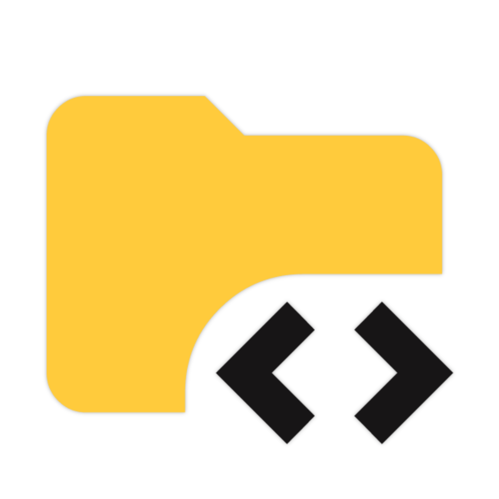
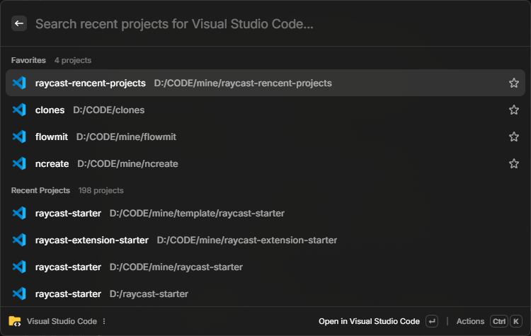

<p align="center">
  
</p>

<h1 align="center">
Recent Projects
</h1>

<p align="center">
A Raycast extension for quickly accessing your recent projects.
</p>



> [!IMPORTANT]
> This extension is totally for Windows users.

## Installation

This extension has not been published to the Raycast Store yet, so you need to install it manually by cloning the repository and running it in development mode.

You should have [Node.js](https://nodejs.org/en/download/) and [pnpm](https://pnpm.io/installation) installed before installing.

1. Clone this repository

```bash
git clone https://github.com/Lu-Jiejie/raycast-rencent-projects
```

2. Go to the cloned directory and install dependencies

```bash
cd raycast-rencent-projects
pnpm install
```

3. Install this extension in Raycast

```bash
pnpm run dev
```

## Supported Applications

- Visual Studio Code
- Cursor

## Configuration

You should configure **exe path** (keep empty to auto-detect) and **storage path** for each application in the setting panel to use them.

The following are the example paths for each application:

### Workspace

#### Visual Studio Code

+ Storage Path: `C:/Users/USER_NAME/AppData/Roaming/Code/User/globalStorage/storage.json`
+ Exe Path: `C:/Program Files/Microsoft VS Code/code.exe`

#### Cursor

+ Storage Path: `C:/Users/USER_NAME/AppData/Roaming/Cursor/User/globalStorage/storage.json`
+ Exe Path: `C:/Program Files/Cursor/Cursor.exe`

### Bookmark

#### Google Chrome

+ Bookmark Path: `C:/Users/USER_NAME/AppData/Local/Google/Chrome/User Data/Default/Bookmarks`
+ Exe Path: `C:/Program Files/Google/Chrome/Application/chrome.exe`

#### Microsoft Edge
+ Bookmark Path: `C:/Users/USER_NAME/AppData/Local/Microsoft/Edge/User Data/Default/Bookmarks`
+ Exe Path: `C:/Program Files/Microsoft/Edge/Application/msedge.exe`
